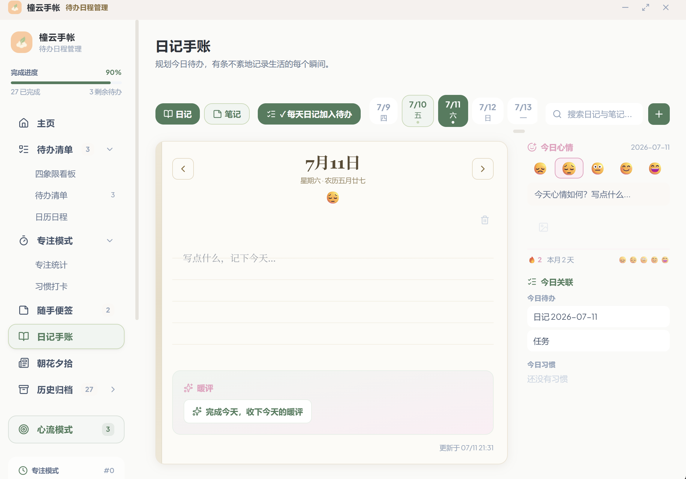
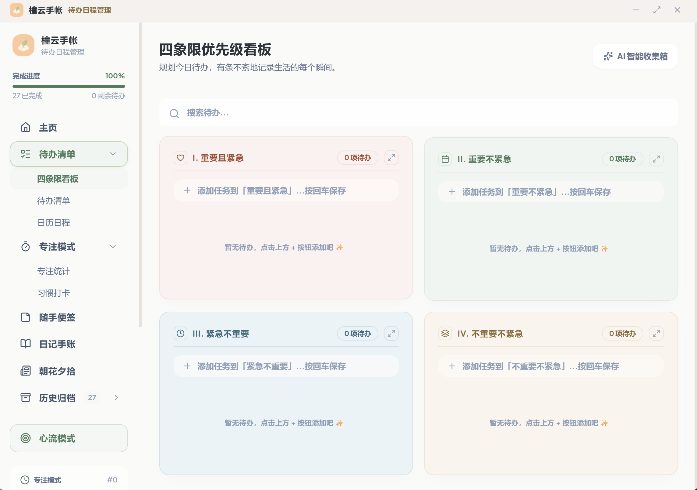
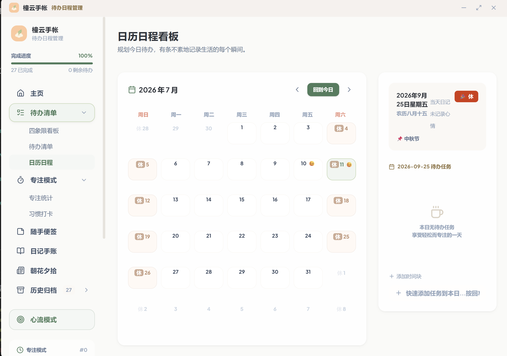
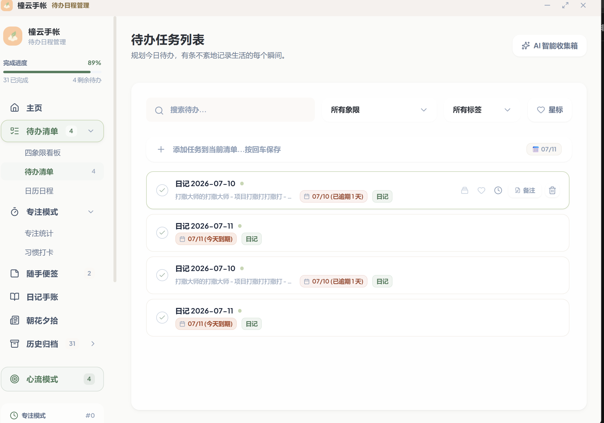
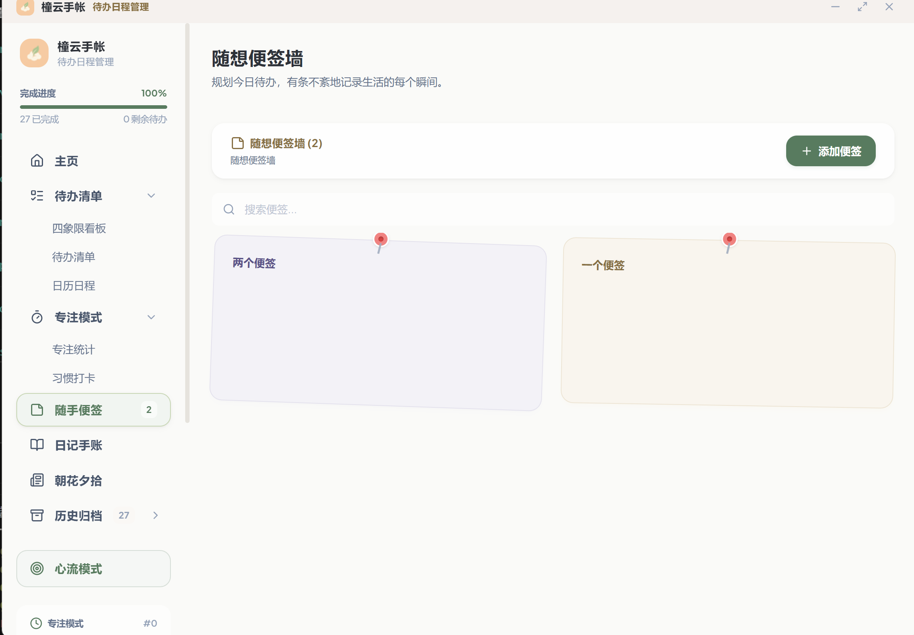
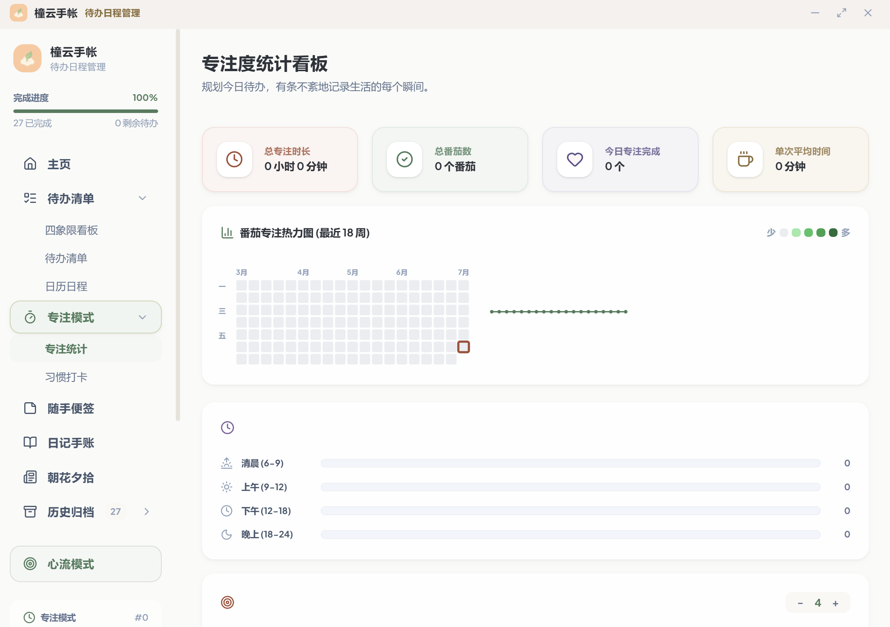
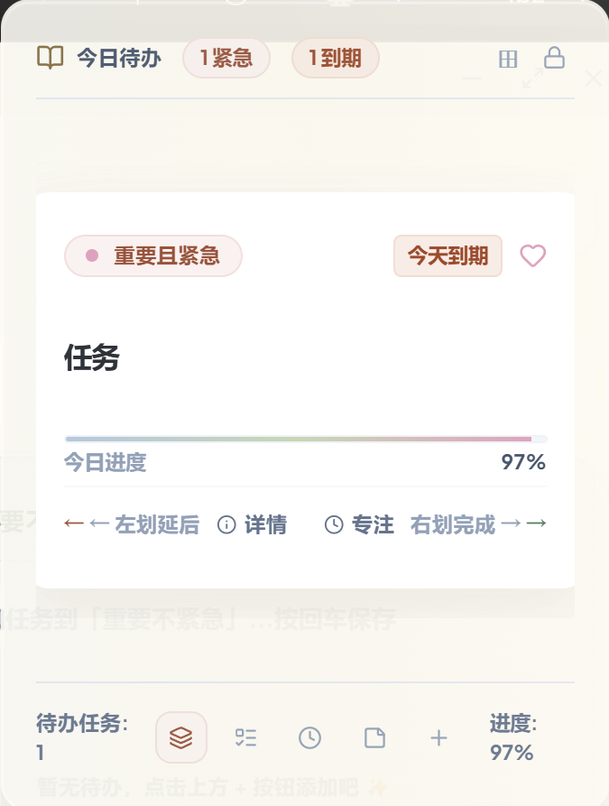
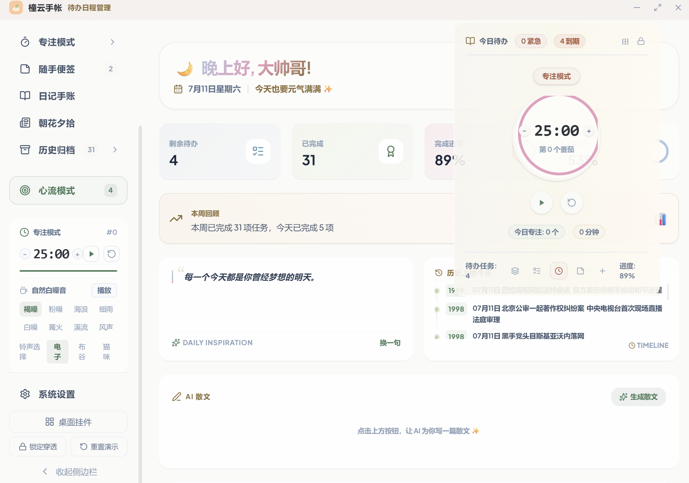
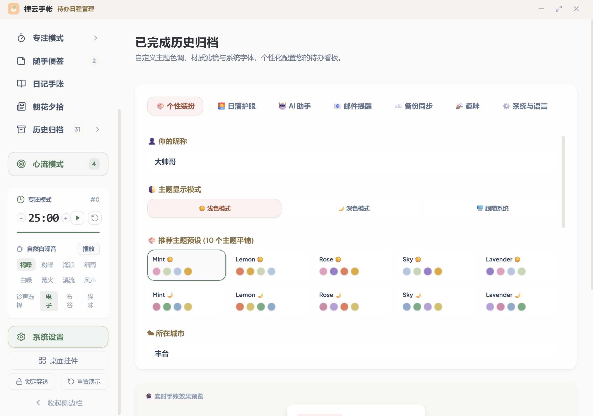

<div align="center">
  

  <h1>橦云手帐</h1>
  <p><strong>TongYun Planner</strong> · 在纷繁世界里，为你留出一块温暖、安宁的心流角落</p>

  <p>
    <a href="https://github.com/yibingzhi/tongyun-planner/releases/latest"><strong>⬇ 下载最新版</strong></a>
    &nbsp;·&nbsp; Windows · macOS Apple Silicon
  </p>

  <p>
    <a href="https://github.com/yibingzhi/tongyun-planner/releases/latest"></a>
    <a href="LICENSE"></a>
    
    
    
  </p>

  <br />

  
</div>

**写给谁：** 想把日记写成仪式、又在意隐私的人——学生、上班族，或任何不想把日常交给云笔记的人。

**解决什么：** 待办散落、日记没处写、资讯看完就忘。四象限任务、翻页日记、番茄钟和资讯一键存成待办，都在同一个本地窗口里。

**有何不同：** 数据默认只在你的电脑上；日记是带书脊与横格的拟物手帐，而不是表单；可选 AI 给出克制的暖评，而不是催促你「更高效」。

<details>
<summary><strong>English</strong></summary>

**TongYun Planner（橦云手帐）** is a local-first desktop journal and task app: Eisenhower matrix, flip-page diary, pomodoro, sticky notes, and optional AI comments. Built for people who want a paper-like ritual and keep their notes on their own machine.

[Download the latest installer](https://github.com/yibingzhi/tongyun-planner/releases/latest) for **Windows** and **macOS Apple Silicon**. The UI is Chinese by default, with a full English language pack in Settings. There is no official Linux installer yet (you can still build from source).

</details>

---

## 界面

| 翻页日记 | 四象限看板 | 日历 |
|:---:|:---:|:---:|
|  |  |  |
| **待办列表** | **便签墙** | **专注统计** |
|  |  |  |
| **桌面挂件** | **番茄钟与白噪音** | **个性化设置** |
|  |  |  |

完整能力清单见 [docs/FEATURES.md](docs/FEATURES.md)。仓库根目录的 [docs/social-preview.png](docs/social-preview.png) 可上传到 GitHub Settings → Social preview（1280×640）。

---

## 隐私与数据

- **默认本地优先。** 任务、日记、便签、番茄记录写在本机（SQLite / 应用数据目录）；作者没有运营收集这些内容的服务器。
- **同步是你自己开的。** 可选 WebDAV（内置坚果云预设，也可填自定义地址）。一旦开启，对应数据会上传到**你配置的远端**。
- **AI 密钥与正文。** 密钥保存在本机设置里。使用 AI 时，相关文本会发往你填写的模型服务商。同步和导出快照都会剥离 AI Key 等密钥字段，密钥只留在本机；换设备后需要重新填写。
- **天气。** 填写城市后，会请求第三方天气接口（当前为 `uapis.cn`），仅发送城市名。

---

## 下载与安装

到 **[Releases · latest](https://github.com/yibingzhi/tongyun-planner/releases/latest)** 取安装包：

| 系统 | 文件 |
|:---|:---|
| Windows（推荐） | `TongyunPlanner_*_x64-setup.exe` |
| Windows（MSI） | `TongyunPlanner_*_x64_en-US.msi` |
| macOS（Apple Silicon） | `TongyunPlanner_*_aarch64.dmg` |

安装包**未做代码签名**。Windows 可能出现 SmartScreen：「更多信息 → 仍要运行」。macOS 请右键安装包 / 应用选择「打开」。没有官方 Linux 安装包。

安装后可在设置里切换 **中文 / English**。

---

## 从源码构建

适合改代码或打 Linux 包。需要 Node.js 18+、Rust，以及各系统的原生编译工具（Windows 需 VS C++ Build Tools；macOS 需 Xcode Command Line Tools）。

```bash
git clone https://github.com/yibingzhi/tongyun-planner.git
cd tongyun-planner
npm install
npm run tauri dev      # 开发
npm run tauri build    # 产出安装包
```

常用脚本：`npm run typecheck` / `npm run check`（前端类型 + Rust）。

---

## 文档

- [功能详单](docs/FEATURES.md) · [更新日志](CHANGELOG.md) · [常见问题](FAQ.md)
- [贡献指南](CONTRIBUTING.md) · [安全说明](SECURITY.md) · [架构](ARCHITECTURE.md)

这是作者一个人、借助 AI 做出来的第一个桌面应用（Tauri 2 + React 19 + Rust）。遇到问题欢迎开 Issue；觉得有用的话，点个 Star 就是最大的鼓励。

本项目以 [MIT License](LICENSE) 开源。
